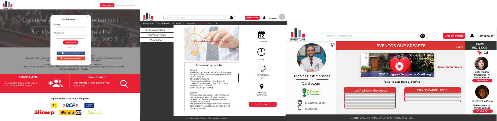

# EventLab

EventLab es una web app donde podrás encontrar los mejores eventos de acuerdo a tus intereses y hacer Networking. Además si eres una empresa u organización, podrás crear eventos eventos de manera fácil y sencilla monitoreando la asistencia de tu público.

## Desarrollado para
[Laboratoria](http://laboratoria.la)

* Hackathon Laboratoria
* Tiempo: 18 horas
* Tema: Organización de eventos.

## Proceso UX
Como parte de nuestra investigación realizamos un **Benchmark** entre diferentes páginas web que ofrecen el servicio de publicación y organización de eventos, así como páginas web de cursos/conferencias online  entre ellos :
- [Joinnus](https://www.joinnus.com/PE?gclid=Cj0KCQjw-uzVBRDkARIsALkZAdkkXUqDayRtEhdza_4QrjNKmjoaw-KfkJ2tyaq4VE5qd8ZULbeHKdAaAqW5EALw_wcB)
- [Ticketea](https://www.ticketea.com/promotor/)
- [Eventbrite](https://www.eventbrite.es/l/registration-online/)
- [CHI 2017](https://chi2017.acm.org/)
- [Coursera](https://www.coursera.org/)
- [Open English](https://www.openenglish.com/)

### Uniendo ideas

En el proceso de **Benchmark** encontramos tres conceptos clave que utilizamos para la creación de EventLab :

* Profesionales
* Cursos/charlas/conferencias
* Networking

### Encuestando usuarios

Realizamos una encuesta para conocer qué perfiles e intereses tendrían cada uno de nuestros usuario y poder adaptarnos a sus necesidades. [Ver encuesta](https://docs.google.com/forms/d/1btca599kTQIbf_LTf13mr6TZCnAQzmXePaVrdG8RGg0/edit).

Organizamos los resultados de la encuesta en el siguiente mapa de afinidad [ver aquí](https://realtimeboard.com/app/board/o9J_kzyPHNE=/)

### El cómo

- **How Might We** que dos usuarios hagan Networking en un evento online.
- **How Might We** para que los usuarios no se olviden de sus eventos inscritos.

### Proponiendo ideas
- **What if** al asistir a eventos los usuarios hacen Networking online con otros usuarios.
- **What if** la web me recuerda eventos.

### Que tiene de diferente EvenLab

- EventLab tiene una opción para crear tarjetas personales online, las cuales podrán ser compartidas con los usuarios asistentes al evento o también ser enviadas a los administradores de eventos y así hacer Nertworking.
- Tiene la opción Agenda/ Calendario para los usuarios, el cual organizará de manera fácil y rápida los distintos eventos a los que asistirá el usuario.

### Versión 1.0 de EvenLab

En esta versión se encuentran los requisitos básico propuestos en la Hackathon de Laboratoria. [ver aquí](https://marvelapp.com/43b88gd/screen/40373443).

## Proceso Front-end

##Integrantes del equipo

* UX designer:

  - Infante Vivas Maythe
  - Zárate Claudia

* Front-end developers:  

  - Palma Milagros
  -
  - 
