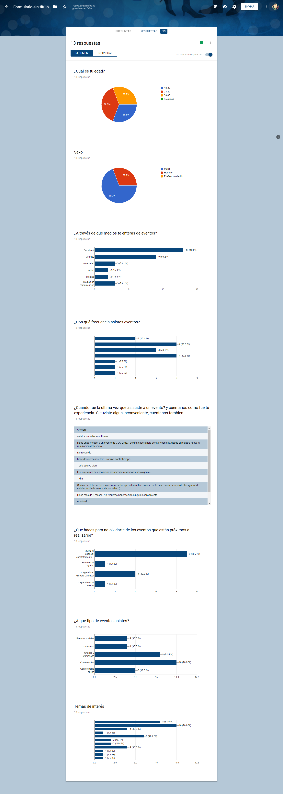
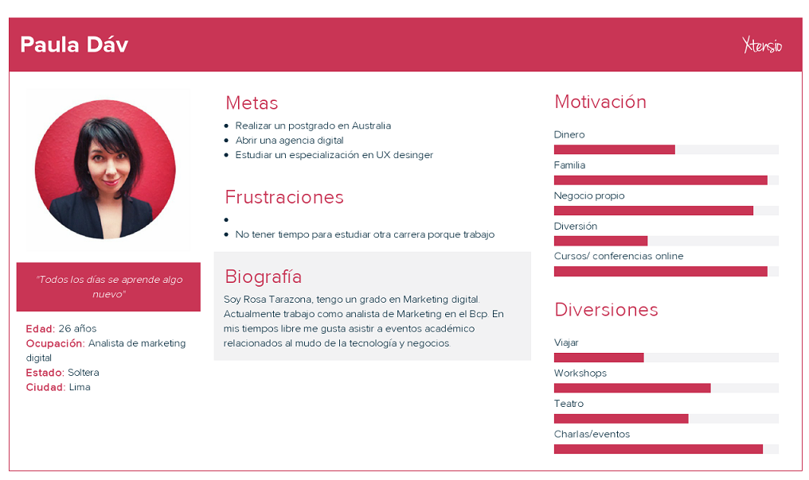

# EventLab

EventLab es una web app donde podrás encontrar los mejores eventos de acuerdo a tus intereses y hacer Networking. Además si eres una empresa u organización, podrás crear eventos de manera fácil y sencilla monitoreando la asistencia de tu público.

## Desarrollado para
[Laboratoria](http://laboratoria.la)

* Hackathon Laboratoria
* Tiempo: 18 horas
* Tema: Organización de eventos.

# Proceso UX

## Research: 

Como parte de nuestra investigación realizamos un **Benchmark** entre diferentes páginas web que ofrecen el servicio de publicación y organización de eventos, así como páginas web de cursos/conferencias online y presenciales, entre ellos :
- [Joinnus](https://www.joinnus.com/PE?gclid=Cj0KCQjw-uzVBRDkARIsALkZAdkkXUqDayRtEhdza_4QrjNKmjoaw-KfkJ2tyaq4VE5qd8ZULbeHKdAaAqW5EALw_wcB)
- [Ticketea](https://www.ticketea.com/promotor/)
- [Eventbrite](https://www.eventbrite.es/l/registration-online/)
- [CHI 2017](https://chi2017.acm.org/)
- [Coursera](https://www.coursera.org/)
- [Open English](https://www.openenglish.com/)

### Uniendo ideas

En el proceso de **Benchmark** encontramos tres conceptos clave que utilizamos para la creación de EventLab :

* Profesionales
* Cursos/charlas/conferencias
* Networking

Documentación de imágenes del proceso de research [ver aquí](https://drive.google.com/drive/folders/1TtUKPs6v6WOMdGXfSV32M_WXAlV8d5DY?ths=true)

## Encuestando usuarios

Realizamos una encuesta para conocer qué perfiles e intereses tendrían cada uno de nuestros usuario y poder adaptarnos a sus necesidades. [Ver encuesta](https://docs.google.com/forms/d/1btca599kTQIbf_LTf13mr6TZCnAQzmXePaVrdG8RGg0/edit).

Organizamos los resultados de la encuesta en el siguiente mapa de afinidad [ver aquí](https://realtimeboard.com/app/board/o9J_kzyPHNE=/)

### El cómo

- **How Might We** que dos usuarios hagan Networking en un evento online.
- **How Might We** para que los usuarios no se olviden de sus eventos inscritos.
- **How Might We** que las personas puedan crear eventos facilmente.
- **How Might We** que las personas encuentren eventos que se ajusten a sus intereses profesionales y académicos.

### Proponiendo ideas
- **What if** al asistir a eventos los usuarios hacen Networking online con otros usuarios.
- **What if** la web me recuerda eventos.
- **What if** el formulario de creación de eventos es fácil de realizarlo.
- **What if** que la búsqueda de eventos sea personalizada.

### Definiendo problemas, creando soluciones- Problem Statement
- {Rosa} necesita hacer networking para ampliar su red de contactos profesionales.
- {Rosa} necesita que le recuerden los eventos para que no se olvide de asistir.
- {Rosa} quisiera que no sea tan complicado organizar eventos.
- {Rosa} necesita encontrar eventos que se ajusten a sus intereses y no perder tiempo en la búsqueda.

## Nuestra Propuesta - ¿Qué es lo que nos hace diferentes?

- EventLab tiene una opción para crear tarjetas personales online, las cuales podrán ser compartidas con los usuarios asistentes al evento o también ser enviadas a los administradores de eventos y así hacer Nertworking.
- Tiene la opción Agenda/ Calendario para los usuarios, el cual organizará de manera fácil y rápida los distintos eventos a los que asistirá el usuario.

### Business Model Canvas

En el siguiente link se encuentran nuestro Business Model Canvas propuesto [ver aquí](https://realtimeboard.com/app/board/o9J_kzyIaAg=/)

## Ideación - Creación de User Persona:

Con la información recaudada del research previa, se construye nuestra User Persona.

### Paper Prototyping

Documentación de imágenes del Paper Prototyping las puedes encontrar en el siguiente enlace [ver aquí](https://drive.google.com/drive/folders/1TtUKPs6v6WOMdGXfSV32M_WXAlV8d5DY?ths=true)

### Versión 1.0 de EventLab

En esta versión se encuentran los requisitos básico propuestos en la Hackathon de Laboratoria. [ver aquí](https://marvelapp.com/43b88gd/screen/40373443).

### Versión 2.0 de EventLab

Para la versión posterior de EventLab, proponemos las siguientes mejoras:

- Proponemos para la versión 2.0 un recordatorio de eventos vinculado al SMS o Whatsapp del usuario.
- Añadir un chat interno para eventos online.
- EventLab tiene una opción para crear tarjetas personales online, las cuales podrán ser compartidas con los usuarios asistentes al evento o también ser enviadas a los administradores de eventos y así hacer Nertworking.
- Ofrecer una red de stakeholders fiables vinculados a la organizacion de eventos (catering, locales,seguridad, música, etc. en la version Premium de EventLab.)

## Proceso Front-end

Se comenzó el proceso diviendo tareas entre maquetaciones y funciones, y se pudo lograr:

  - Loguearse con Firebase.
  - Maquetar con React.

## Integrantes del equipo

* UX designer:

  - Infante Vivas Maythe
  - Zárate Córdova Claudia

* Front-end developers:  

  - Canales Gessenia
  - Palma Milagros
  - Segura Elizabeth
  
